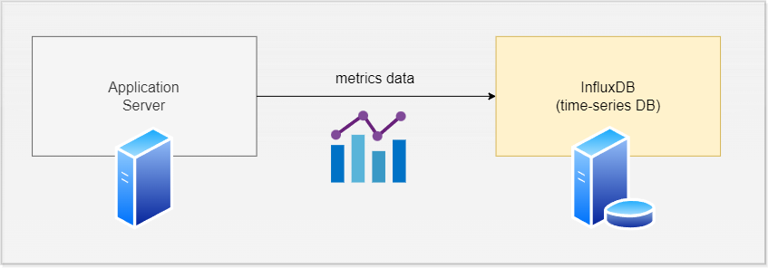
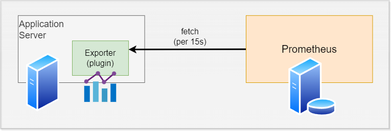

<!-- Export時にfont-awesomeが取り込めてないっぽいのでワークアラウンド -->
<link href="https://use.fontawesome.com/releases/v5.1.0/css/all.css" rel="stylesheet">

## リアルタイムサーバーの メトリクス可視化

リアルタイム性が求められるサービスの メトリクス収集・分析・監視ソリューション検討

   _Yu Kusanagi_ {.text-right .fs2rem}

---

## メトリクス可視化とは

{style="width: 70%;"}

CPU, メモリ使用量, ネットワークトラフィックなど 
サーバーの状態をデータとして収集・可視化

---

## モチベーション

- リアルタイムサーバー = オンラインゲームなどのリアルタイム性が求められるバックエンド{.fs2rem}
- 安定性およびパフォーマンスがシビアに重視される{.fs2rem}
    - サーバーの問題でマッチング・インゲームが開始できないと一瞬でユーザーが離れる{.fs2rem}
    - 同時接続人数等の要件を満たしたとしても、パフォーマンスが悪いと運用費がかさむ{.fs2rem}
- 稼働時だけでなく、開発中もパフォーマンスを可視化しておくことで問題の早期発見・解決につなげたい{.fs2rem}
    - = ローカル環境でのパフォーマンスチューニング{.fs2rem}

--

- 一般的なWebサービスではデファクトスタンダードが存在する -> [ElasticSearch](https://www.elastic.co/jp/elasticsearch) や[Prometheus](https://prometheus.io/) + [Grafana](https://grafana.com/ja/)
- リアルタイムサーバーでは何を採用すべきか？
- **「デファクトはないっすね」**
    - by 某大規模IPタイトルMMOゲームエンジニア{.ls-none .fs2rem}

---

## メトリクス可視化 ソリューションの選択肢

--

## Elastic Search (on AWS)
- ECサイトなどでのログ解析ではデファクト
- 堅牢なエコシステム
- マッシブなトラフィックに耐えられるインフラ
- 🤔 ローカル環境での運用は事実上不可能

--

## Prometheus + Grafana

- Prometheus: メトリクス収集
- Grafana: 可視化(ビジュアライゼーション)
- Web全般的にそれなりのデファクト性
- k8sと併用するノウハウも多い（スケール耐性）
- ローカル・dockerでも運用可能
- 🤔 Pull型のデータ蓄積
    - データのタイムスタンプが Prometheusのタイムスタンプに依存する
- 🤔 msecオーダーの解析には見せ方の工夫が必要

--

## Influx DB (時系列DB)  + 可視化サービス(Grafana等)
- 愚直で柔軟な構成
- リアルタイム性の高いデータ収集
- ローカル・dockerでも運用可能
- 🤔 高負荷アラートなどは自前での実装が必要
- 🤔 自前でスケーリングの設計が必要

--

## 最終手段: 自前で作る

**やめといたほうがいい**  

既存のソリューションを踏まえたうえで 欲しい要件がある場合に限る

---

## Push型 / Pull型について

--

## Push型: InfluxDBの例

**Push型** : サーバー側がデータを送信する

--

## Pull型: Prometheusの例

- **Pull型** : メトリクスサービス側がアプリサーバーのデータを取得しに行く{.fs2rem}
- アプリ側に **Prometheus Exporter** プラグインをインストール{.fs2rem}
    - `/metrics` エンドポイントが生える{.fs2rem}
- Prometheusサーバーが定期的(15s間隔とか)に `/metrics` にアクセスし、メトリクスを取得{.fs2rem}

--

**Prometheusではデータのタイムスタンプ = アクセス時刻となる**
- アプリケーションサーバー自身のタイムスタンプをデータとして残せない
- 関数の実行時間など、msecオーダーの解析にはデータの見せ方に工夫が必要

---

## Grafanaについて

- データ可視化ツールとしてはデファクト
- Prometheus, InfluxDB など多くのデータソースに対応
- 古くから存在するが未だに活発（UIおしゃれ）
- ビジュアライゼーション向けのデータ加工機能が豊富
- 大体欲しい機能はなんでもある。手放しで採用してよし(2024 個人の感想)

--

## Grafanaのデモ

Sandboxがあるよ
https://play.grafana.org/

---

end
<!-- end -->